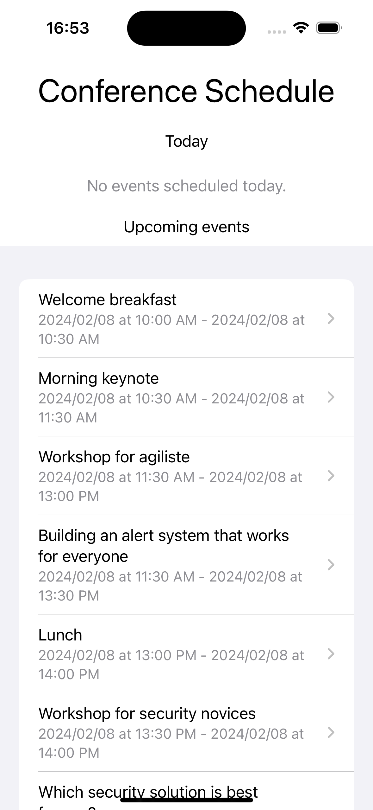
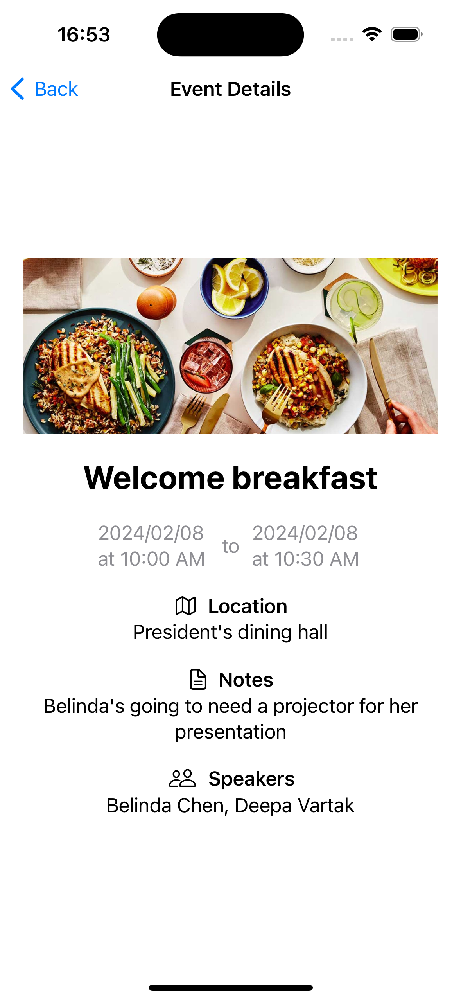

# Mobile Development - Project (2024)

Authors:
- Baptiste BILLY-GAGNAIRE
- Ayyoub ZEBDA
- Dèlidji Aurel Celyn GBAGUIDI

## App Architecture
We have applied a Model-View-Controller architecture to develop our application.

### Controller:
- `NetworkManager`: Allows making requests to the AirTable API to retrieve data about Events and Speakers.

### Models:
- `ScheduleModel`: Defines how the data structure of "Event" objects is represented as retrieved from the Database. It also includes an extension of the "Date" class that allows us to convert Strings into Date objects.
- `SpeakerModel`: Defines how the data structure of "Speaker" objects is represented as retrieved from the Database.

### Views:
- `HomeView`: This is the home page of our application. It contains one or more instances of the `EventListView` component, separated into two categories (events scheduled for today and upcoming events).
- `EventListView`: Represents a list of events, with each item linking to a detailed page of the corresponding event.
- `EventDetailView`: Provides all the information about an event. A different banner is displayed based on the type of the event.

    
    

